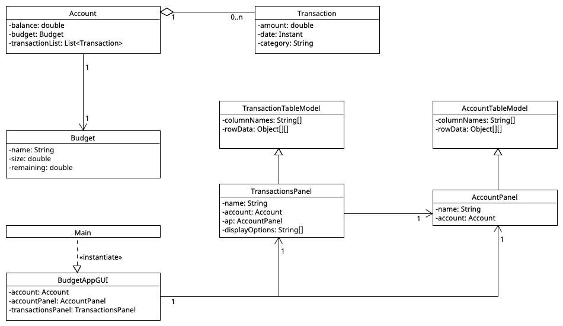

# Financially
A budget and expense management application.

The app will allow users to:
- Create budgets
- Record expenses
- Visualize spending

As someone who is bad at budgeting and an impulse buyer, I believe that I am the target audience for the application. Being able to visualize my spending by category and setting budgets for each week/month would allow me to feel more in control of my finances and be more aware of the impact each purchase makes. I hope.

**USER STORIES**
- As a user, I want to be able to create a budget
- As a user, I want to be able to add a transaction (deposit/withdrawal) to my transaction list
- As a user, I want to be able to see how much of my budget remains
- As a user, I want to be able to see how much money I have
- As a user, when I select the quit option, I want to be reminded to save the data from my current session to file and have the option to do so or not
- As a user, when the application starts, I want to be given the option to load my account from file


# Instructions for Grader

- You can generate the first required action related to adding Xs to a Y by navigating to the Transactions and selecting either "Record Deposit" or "Record Withdrawal". After you enter the size of your Transaction, select "OK" and then you should be able to see your new Transaction (X) has been added to our list of transactions (Y).
- You can generate the second required action related to adding Xs to a Y by selecting a display option from the dropdown box found in the Transactions menu. You can choose to display all transactions that are either Deposits, Withdrawals, or both.
- You can locate my visual component by loading the application. My visual component was my splashscreen.
- You can save the state of my application by hovering over the "Options" menu item, and then selecting "Save". 
- You can reload the state of my application by hovering over the "Options" menu item, and then selecting "Load". 

## Phase 4: Task 2
```
Wed Apr 12 18:02:45 PDT 2023
Transaction recorded: $50.0 TYPE: DEPOSIT
Wed Apr 12 18:02:50 PDT 2023
Transaction recorded: $-29.0 TYPE: WITHDRAWAL
Wed Apr 12 18:02:52 PDT 2023
Transaction recorded: $-30.0 TYPE: WITHDRAWAL
Wed Apr 12 18:02:55 PDT 2023
Transactions filtered: DEPOSITS now displayed
Wed Apr 12 18:02:58 PDT 2023
Transaction recorded: $-50.0 TYPE: WITHDRAWAL
Wed Apr 12 18:03:01 PDT 2023
Transactions filtered: WITHDRAWALS now displayed
Wed Apr 12 18:03:04 PDT 2023
Transactions filtered: ALL now displayed
```

## Phase 4: Task 3

If you compare the Account and Budget classes, you would notice that a Budget is essentially a type of Account that cannot withdraw 
(with some special budget related fields added). To refactor my code I think that I would create a new superclass of Account that had the
ability to store funds only. Then Account and Budget would extend these classes and add only the class specific functionality to each.
By doing this I would be able to avoid a lot of the duplication of code and only where I have a function like recordTransaction()
which is different in the case of an Account and Budget, I would use an `@Override` tag and then write the implementation needed.
Furthermore, my table models could have also been simplified as they were essentially the same, with the only difference being the stored column names, 
which I could have passed in to a more generalized table model at instantiation.
